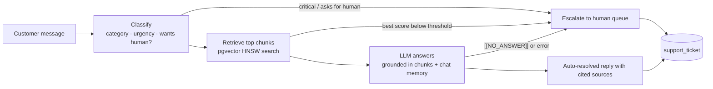

# Intelligent Customer Support Orchestrator

An autonomous customer-support agent built with **Spring Boot**, **LangChain4j** and **PostgreSQL + pgvector**.
It answers questions using Retrieval-Augmented Generation (RAG) over your technical documentation and hands
tickets to a human when it shouldn't answer on its own.



## How it works

| Stage | What happens | Code |
|---|---|---|
| **Ingestion** | Files (Markdown, PDF, Word, HTML, ...) are parsed with Apache Tika, split into overlapping 800-character chunks, embedded in-process with all-MiniLM-L6-v2, and stored in pgvector. Files are processed in batches and fingerprinted with SHA-256, so re-syncs only embed new or changed files. | `knowledge/DocumentIngestionService` |
| **Classification** | An LLM call turns the message into structured data: category, urgency, and whether the customer asked for a human. | `agent/TicketClassifier` |
| **Retrieval** | The question is embedded and the top 5 chunks are fetched by cosine similarity through an HNSW index. Short follow-ups ("and on Mac?") that retrieve nothing are retried with the previous question from the session. | `knowledge/KnowledgeBaseRetriever`, `chat/SupportOrchestrator` |
| **Answering** | The agent answers only from the retrieved excerpts, cites them, and returns `[[NO_ANSWER]]` when the answer isn't in the docs. Conversation history is kept per session in Postgres. | `agent/SupportAgent`, `resources/prompts/` |
| **Escalation** | Rules for when a human takes over: critical urgency, the customer asks for a human, low retrieval confidence (checked *before* the LLM call, which saves cost), the model can't answer, or the model call fails. | `chat/EscalationPolicy` |
| **Tracking** | Every query is stored as a ticket, whether auto-resolved or escalated. `/api/metrics` reports the deflection rate: the share of queries resolved without a human. | `ticket/` |

## Quick start

Requirements: Docker, plus access to Claude either through **Amazon Bedrock** (default) or an
**Anthropic API key**.

**Amazon Bedrock** (uses your AWS login from `aws configure`; the full walkthrough is in
[docs/aws-bedrock-setup.md](docs/aws-bedrock-setup.md)):

```bash
LLM_MODEL=<model-id-from-bedrock-console> docker compose up --build
```

**Anthropic API**:

```bash
LLM_PROVIDER=anthropic LLM_MODEL=claude-opus-5-5 ANTHROPIC_API_KEY=your-key docker compose up --build
```

Open http://localhost:8080 to use the chat page. On startup the app embeds everything in `sample-docs/`.

### Running without Docker for the app

```bash
docker compose up -d postgres
export LLM_PROVIDER=bedrock LLM_MODEL=<model-id> AWS_REGION=us-east-1
mvn spring-boot:run
```

### Tests

```bash
mvn test
```

The tests need no API key or database. They cover the escalation rules, the orchestration flow (with mocked
LLM calls), and retrieval quality: the real embedding model runs over the sample docs and the tests check
that each question retrieves the right document and that unrelated questions score below the answer threshold.

## API

| Method | Path | Purpose |
|---|---|---|
| `POST` | `/api/chat` | `{"sessionId": "...", "customerId": "...", "message": "..."}`. Returns the answer, category, urgency, whether it was escalated (and why), and the sources used. |
| `POST` | `/api/knowledge-base/sync` | Re-scan the docs folder (new and changed files only) |
| `POST` | `/api/knowledge-base/documents` | Upload files (multipart field `files`) and embed them |
| `GET` | `/api/knowledge-base/search?q=...` | See which chunks the agent would get for a query, with scores |
| `GET` | `/api/knowledge-base/stats` | Number of documents and chunks indexed |
| `GET` | `/api/tickets?status=ESCALATED` | The human queue |
| `POST` | `/api/tickets/{id}/resolve` | `{"resolution": "..."}`. A human closes an escalated ticket. |
| `GET` | `/api/metrics` | Total queries, auto-resolved, escalated, deflection rate, latency, per-category counts |

Example:

```bash
curl -s localhost:8080/api/chat -H 'Content-Type: application/json' \
  -d '{"sessionId":"demo","message":"I get error 1603 when installing on Windows"}'
```

## Using your own documentation

Point `DOCS_PATH` at a folder of your docs (any mix of `.md`, `.pdf`, `.docx`, `.html`, `.txt`, ...) and
call `POST /api/knowledge-base/sync`, or restart the app. Subfolders are included. Things built for large corpora:

- **Batching**: documents are embedded 100 at a time (`app.ingestion.batch-size`), which bounds memory use.
- **Incremental sync**: unchanged files are skipped by content hash. A changed file has its old chunks deleted before the new ones are added, so the model never sees stale text.
- **Local embeddings**: the embedding model runs in the JVM, so embedding thousands of documents has no API cost.
- **HNSW index**: search stays fast as the corpus grows, and the index needs no retraining as documents are added.

## Configuration

Everything is in `src/main/resources/application.yml` and can be overridden with environment variables.

| Setting | Default | Meaning |
|---|---|---|
| `LLM_PROVIDER` | `bedrock` | `bedrock` (Claude via AWS) or `anthropic` (Claude via the Anthropic API) |
| `LLM_MODEL` | `anthropic.claude-opus-5-5` | Model ID for the provider; for Bedrock, copy it from the console |
| `AWS_REGION` | `us-east-1` | Bedrock region |
| `app.retrieval.max-results` | 5 | Chunks given to the model |
| `app.retrieval.min-score` | 0.55 | Chunks below this similarity are dropped |
| `app.retrieval.answerable-score` | 0.65 | Best chunk must reach this or the ticket escalates without an LLM call |
| `app.ingestion.chunk-size` / `chunk-overlap` | 800 / 100 | Chunking, in characters |
| `app.memory.max-messages` | 10 | Conversation turns remembered per session |
| `DB_URL`, `DB_USER`, `DB_PASSWORD` | local `support` DB | Postgres connection |

The two score thresholds matter most for quality. Use `/api/knowledge-base/search` on real questions to
tune them for your documents.

## Project layout

```
src/main/java/com/supportorchestrator/
├── agent/       LangChain4j AI services (classifier, support agent)
├── chat/        REST entry point, orchestration pipeline, escalation rules
├── config/      model, embedding store and memory wiring; typed properties
├── knowledge/   ingestion, retrieval, knowledge-base endpoints
├── memory/      Postgres-backed chat memory
└── ticket/      ticket entity, human queue, metrics
src/main/resources/
├── prompts/     system and user prompt templates
└── db/migration Flyway schema (tickets, chat memory, pgvector table + HNSW index)
sample-docs/     example knowledge base
```

## Ideas for next steps

- An evaluation set: 50–100 real questions with expected source documents, to measure retrieval hit rate and answer accuracy while you tune prompts and thresholds
- Hybrid search (keyword + vector) for exact error codes and product names
- Streaming responses to the chat page
- Authentication on the ticket and knowledge-base endpoints
- Load testing (for example with k6) to measure throughput under concurrent sessions
